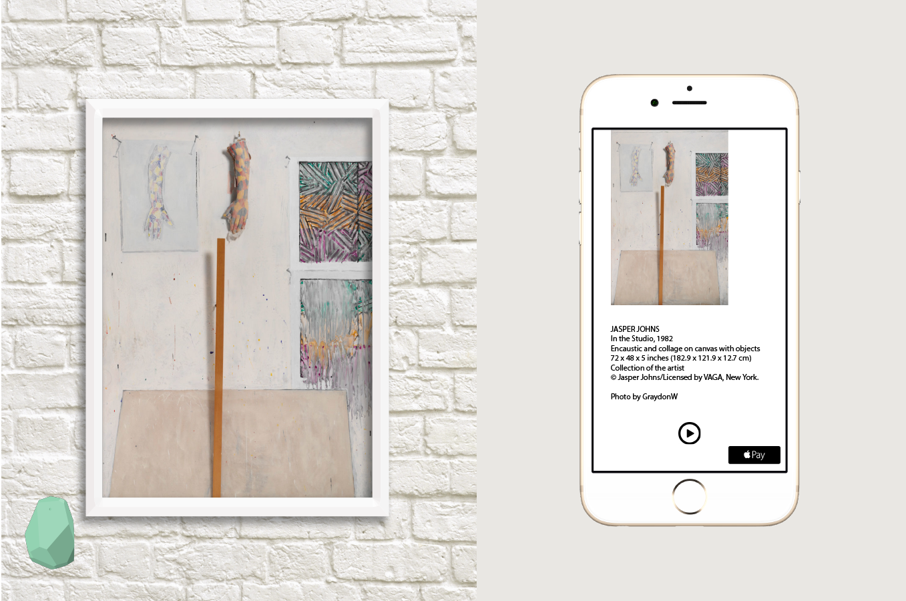
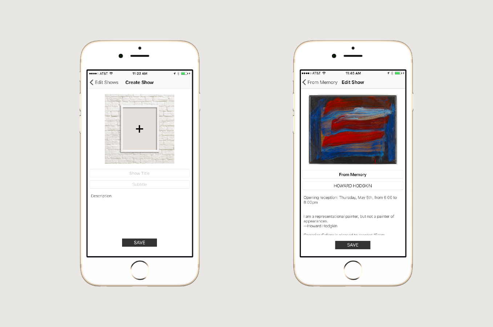
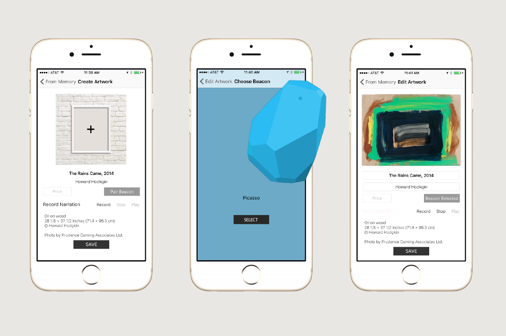

# galleryBeacon

## About

Idea: An app with iBeacon integration that replaces the plaque along side an art piece and provides additional context for visitors

- User enters a space, walks within the proximity of an Estimote Beacon and is presented with unique information based on the specific piece of art near the proximity of the beacon

- The purpose of this app is to provided an informative, smartphone gallery experience using low energy bluetooth iBeacons.

## About iBeacon

- iBeacon is a technology based on low energy Bluetooth
- LEB transmits data over smaller areas
- LEB consumes far less power than traditional Bluetooth technologies

### About Estimote

- iBeacon hardware, tiny computer powered by coin battery
- Smart devices in range receive signals and can respond

## MVP

- An app that presents a launch screen, Home ViewController with map and dynamic ViewControllers that change based on unique iBeacon proximity

## WireFrames

## Group Members

### Hannah Gaskins 🏓
[Hannah's GitHub](https://github.com/hnag409) 
[Hannah's LinkedIn](https://www.linkedin.com/in/hannahgaskins)

### Jeremy Moore ⚔
[Jeremy's GitHub](https://github.com/damoores) 
[Jeremy's LinkedIn](https://www.linkedin.com/in/jeremy-moore-78515a7b)

### Erin Roby 🎈
[Erin's GitHub](https://github.com/erinroby) 
[Erin's LinkedIn](https://www.linkedin.com/in/erinroby)

### David Swaintek 🎹
[David's GitHub](https://github.com/Swaintek) 
[David's LinkedIn](https://www.linkedin.com/in/davidswaintek)
